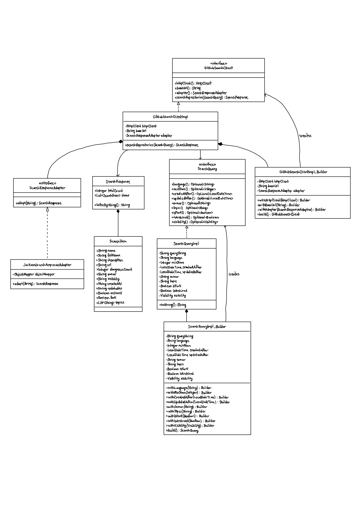

# GitHub Search Client

A client for the GitHub API written in Java for SWE4403 to practice implementing Builder Pattern.

It supports searching repositories, but is built to be extended to further endpoints.

The Builder pattern implemented loosely follows the Gang of Four implementation but is to fit the fluent API and 
tailored to modern java idioms and practices similar to [this article](https://akhiilgupta.medium.com/create-complex-java-objects-using-fluent-builder-pattern-c2263f8bfcf4). It also uses the Adapter pattern for mapping the raw JSON response to an inner model.

## Part 1
**Select two design patterns** (e.g., Singleton, Observer, Factory) and:
- Describe their **use cases** and **structure** in your own words.
- Provide a **comparison**: When would one be more appropriate than the other?

Builder Pattern:

- Structure: A separate builder class handles step-by-step object creation
- Use cases: Create objects with many optional parameters, complex construction steps

Singleton Pattern:

- Structure: A single instance with global access point via private constructor and static get method
- Use cases: Managing shared resources and global values

Comparison:
- Builder is best for:
  - Object creation involves multiple steps, or you need to build a complex object
  - You need flexibility in object construction

- Singleton is best for:
  - Exactly one instance must exist system-wide
  - Strict access control to shared resource is required

In summary, Builder focuses on flexible object creation, while Singleton controls instance access and ensures uniqueness.

## Part 2
**Implement a small program or module** using one of the chosen design patterns:
- Your implementation should be **clear, well-documented, and functional.**
- If modifying an existing solution, describe **what changes you made and why.**

[Source code](https://github.com/matthew-collett/github-search-client/blob/main/src/java/com/collett/github)

## Part 3
**Submit a hand-drawn UML diagram**:
- Create a UML **class diagram or sequence diagram** representing your implementation.
- Include annotations or brief notes explaining key relationships and decisions.

## Part 4
**Upload a video explanation (Max 5 Minutes):**
- Explain **why you chose the pattern** and how it fits the problem. 
- Walk through your **code structure and key decisions.**
- Highlight any **challenges you faced** and how you solved them.
- The video can be recorded using **Teams** or **Streams.**

[Video Link](https://youtu.be/-XEJhDkSafM)

